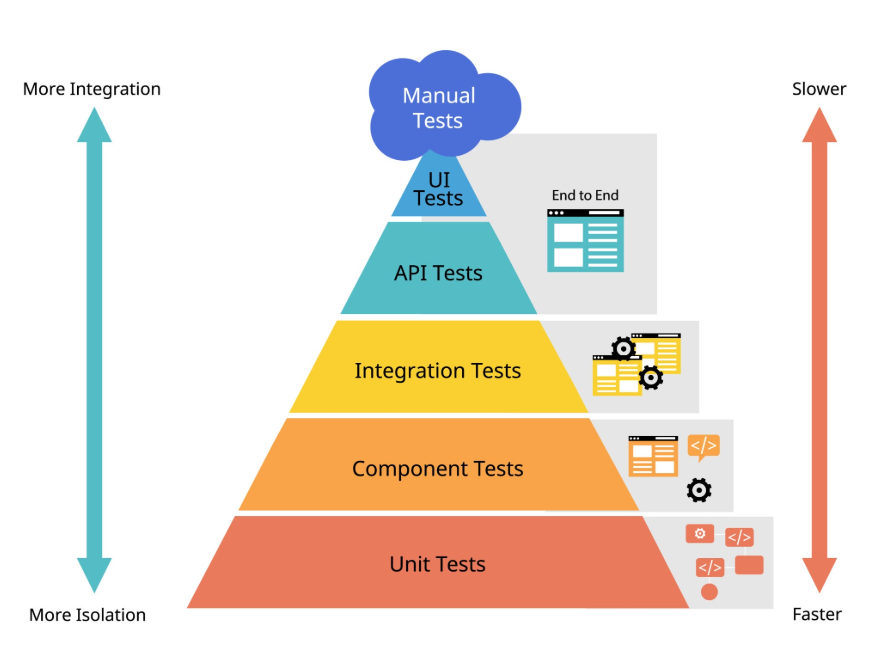
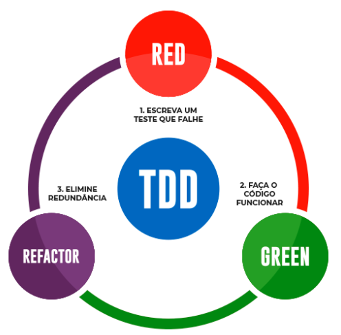

## 1. FUNDAMENTOS DE QUALIDADE & PIRÂMIDE DE TESTES

1. **O VALOR DA GARANTIA DE QUALIDADE (QA)**
Testar software não é apenas encontrar bugs, é garantir que o sistema atenda aos requisitos com **segurança, previsibilidade e baixo custo de manutenção**. O custo de corrigir uma falha em produção é até 100 vezes maior do que corrigi-la durante a fase de desenvolvimento.

💡 Analogia: Escrever testes é como colocar cinto de segurança e airbags em um carro. Você não os instala esperando bater, mas para garantir que, se algo falhar, o impacto seja controlado e sem fatalidades.

2. **A PIRÂMIDE DE TESTES DE MIKE COHN**
A Pirâmide de Testes é um modelo visual que orienta como distribuir os diferentes tipos de testes no seu projeto para obter o melhor equilíbrio entre velocidade, custo e confiabilidade:

- Base (Testes Unitários): Rápidos, baratos, isolados e em grande quantidade. Testam funções e métodos individuais.
- Meio (Testes de Integração): Verificam a comunicação entre módulos, bancos de dados e APIs externas.
- Topo (Testes End-to-End / E2E): Lentos e mais caros. Simulam a jornada completa do usuário na interface (UI).

3. **TEST DOUBLES: MOCKS, STUBS E FAKES**
Para testar uma unidade sem depender de serviços externos (como gateways de pagamento ou envio de e-mails), utilizamos "dublês de teste" (Test Doubles):

``Stub: Retorna dados estáticos pré-programados const paymentStub = { process: () => ({ status: 'APPROVED' }) }; // Mock: Registra e valida se o método foi chamado corretamente const emailMock = vi.spyOn(emailService, 'send'); expect(emailMock).toHaveBeenCalledWith('user@email.com');``

**⚠️ O ANTI-PADRÃO: O "SORVETE DE CASQUINHA" (ICE CREAM CONE)**
Evite inverter a pirâmide criando poucos testes unitários e muitos testes manuais ou E2E de interface. Isso torna a suíte extremamente **lenta, cara de executar e sujeita a falsos negativos (Flaky Tests)**.

## 2. Anatomia de Testes

**ANATOMIA DO TESTE UNITÁRIO & PADRÃO AAA**

1. **ESTRUTURAÇÃO COM O PADRÃO AAA (ARRANGE, ACT, ASSERT)**
Todo teste unitário limpo deve ser dividido em três fases distintas para facilitar a leitura e o diagnóstico de falhas:

- **Arrange (Preparar):** Configura o ambiente, cria instâncias, variáveis e fakes necessários.
- **Act (Executar):** Chama o método ou ação que está sendo testado.
- **Assert (Verificar):** Valida se o resultado obtido é idêntico ao resultado esperado.

2. **EXEMPLO PRÁTICO EM TYPESCRIPT / JEST / VITEST**

Veja como o padrão AAA deixa a intenção do teste clara e autoexplicativa:

describe('CarrinhoDeCompras', () => { it('deve aplicar desconto de 10% para compras acima de R$ 100', () => { 
    
    // 1. Arrange (Preparar) const carrinho = new CarrinhoDeCompras(); carrinho.adicionarItem({ nome: 'Livro', preco: 120.00 }); 
    // 2. Act (Executar) const valorFinal = carrinho.calcularTotalComDesconto(); 
    // 3. Assert (Verificar) expect(valorFinal).toBe(108.00); }); });

3. **TESTANDO CASOS DE BORDA (EDGE CASES)**
Testes não devem validar apenas o "caminho feliz" (Happy Path). É essencial testar limites como: **valores nulos, arrays vazios, strings imensas, números negativos e estouro de limites**.

## 3. TDD

**O CICLO RED, GREEN, REFACTOR**
TDD não é uma técnica de teste, mas uma **metodologia de design de software** onde o teste é escrito antes do código de implementação.

**O Ciclo Vital:**
1. RED: Escreva um teste que falha (pois a funcionalidade ainda não existe).
2. GREEN: Escreva o código mais simples possível para fazer o teste passar.
3. REFACTOR: Melhore o código e aplique Clean Code mantendo os testes verdes.

## 4. TESTES DE INTEGRAÇÃO & COBERTURA DE CÓDIGO (COVERAGE)

Enquanto os testes unitários garantem que cada peça individual funciona, os **Testes de Integração** garantem que as peças funcionam juntas quando conectadas a bancos de dados reais, filas ou APIs.

**Métricas de Cobertura de Código (Code Coverage):**
- **Line Coverage:** Percentual de linhas de código executadas durante os testes.
- **Branch Coverage:** Percentual de caminhos condicionais (if/else) percorridos.
- **Function Coverage:** Percentual de funções declaradas que foram chamadas.

**📊 100% DE COBERTURA NÃO GARANTE ISENÇÃO DE BUGS**
Uma cobertura de 100% apenas indica que todas as linhas foram executadas, mas não que foram testadas com os cenários de negócio ou entradas de borda corretos. Busque **qualidade de asserções**, não apenas métricas vaidosas.

## 5. Prevenção de danos

**O CUSTO PROGRESSIVO DA CORREÇÃO DE BUGS (REGRA DE BOEHM)**
De acordo com os estudos de Barry Boehm, o custo de corrigir uma falha cresce exponencialmente à medida que o software avança no ciclo de vida. Um erro corrigido durante a fase de especificação custa 1x; o mesmo erro em produção pode custar mais de 100x em horas de suporte, imagem manchada e potenciais multas regulatórias.

**Analogia da Construção Civil:** Descobrir que o encanamento do banheiro foi colocado no lugar errado na planta do projeto custa o preço de apagar uma linha de lápis. Descobrir isso com o prédio pronto e os moradores morando exige quebrar azulejos, pisos e interromper o abastecimento de água.

**O PRINCÍPIO DE DIJKSTRA E A COBERTURA REAL**

Como dizia Edsger Dijkstra: "Os testes de software podem mostrar a presença de bugs, mas nunca a sua ausência." O objetivo da suíte automatizada é reduzir drasticamente os riscos a um nível aceitável, funcionando como uma rede de segurança contra o efeito colateral da regressão (quebrar algo que funcionava ao criar algo novo).

## 6. Filosofia de QA e Regra de Myers

**O OBJETIVO REAL DO TESTE DE SOFTWARE**
Existe um mito de que testar serve para provar que o sistema não tem erros. Na verdade, segundo a Engenharia de Software, o objetivo do teste é encontrar falhas ocultas o mais cedo possível. Um teste que encontra um bug é um teste bem-sucedido.

**Analogia da Inspeção Veicular:** Pense em um teste de colisão (Crash Test) na fábrica de carros. A equipe não torce para o carro ficar intacto; ela quer ver onde a lataria amassa e onde o airbag falha dentro da fábrica, para que o cliente nunca descubra essa falha na estrada.

**A REGRA DOS DEZ (CUSTO DE CORREÇÃO DE BUGS)**
O custo de corrigir uma falha escala exponencialmente à medida que o software avança no seu ciclo de vida (SDLC):

- **Fase de Requisitos / Design:** Custo $1x (Apenas reescrever um documento).
- **Fase de Desenvolvimento (Teste Unitário):** Custo $10x (O dev corrige a linha de código em minutos).
- **Fase de Homologação / QA:** Custo $100x (Exige novo build, retestes e bloqueio de release).
- **Fase de Produção (Cliente Final):** Custo $1000x+ (Prejuízo financeiro, perda de reputação e vazamento de dados).

## 7. Pirâmide detalhada

ENTENDENDO CADA CAMADA COM ANALOGIAS

1. **Teste Unitário (A Lâmpada):**
Testa o menor pedaço de código isolado possível (uma função, uma classe). Não acessa banco de dados nem internet. Executa em milissegundos.
Analogia: Testar se a lâmpada acende na bancada antes de instalá-la na casa.

2. **Teste de Integração ( O Bocal e o Interruptor):**
Testa se dois ou mais componentes funcionam juntos (ex: seu repositório salvando dados no PostgreSQL real).
Analogia: Rosquear a lâmpada no bocal e testar se a fiação até o interruptor está conduzindo energia.

3. **Teste End-to-End / E2E (A Casa Inteira):**
Simula um usuário real clicando na tela, abrindo o navegador (via Playwright/Cypress) e completando um fluxo.
Analogia: Entrar na casa, ligar o disjuntor principal, pressionar o interruptor e checar se a sala ficou iluminada.

**MATRIZ COMPARATIVA DE NÍVEIS DE TESTE**

Tipo	        Velocidade	        Custo	    Isolamento	    Causa da Falha
Unitário	    Ultrarrápido       (< 5ms)	    Muito Baixo	    Total (Sem I/O)	Muito Fácil de achar
Integração	    Médio            (100ms - 2s)	Moderado	    Parcial (DB / API)	Médio
E2E (UI)	    Lento            (5s - 30s+)	Alto	        Nenhum (Sistema real)	Difícil (Flaky)

## 8. Testes doubles

**O QUE SÃO TEST DOUBLES?**
Em um filme de ação, quando o ator principal precisa saltar de um prédio, um dublê entra em seu lugar para que a cena aconteça sem ferir o ator. Em software, quando a função testada precisa enviar um e-mail real ou fazer uma cobrança no cartão de crédito, usamos um Dublê para simular esse comportamento sem gasto financeiro ou efeitos colaterais reais.

**COMPARAÇÃO PRÁTICA COM CÓDIGO (JAVASCRIPT)**

Exemplo utilizando objetos literais e funções de spia/mock do Jest ou Vitest em JavaScript puro:

// 1. STUB: Objeto JS com resposta 'chumbada' e determinística const gatewayPagamentoStub = { autorizar: () => ({ sucesso: true, transacaoId: "TX123456" }) }; 
// 2. MOCK / SPY: Objeto para rastrear chamadas e parâmetros recebidos const servicoEmailMock = { enviar: jest.fn() // Função espiã que registra execuções }; 
// Execução da função ou classe sob teste const processarPedido = require('./processarPedido'); await processarPedido(pedido, gatewayPagamentoStub, servicoEmailMock); 
// Validação do Mock (Verifica se o e-mail foi disparado com o endereço correto) expect(servicoEmailMock.enviar).toHaveBeenCalledWith("cliente@email.com", "Pedido Aprovado!");

## 9. TDD NA PRÁTICA: AS TRÊS LEIS DE UNCLE BOB

Para aplicar o TDD (Test-Driven Development) de verdade, Robert C. Martin (Uncle Bob) definiu Três Leis Fundamentais:

- **1ª Lei:** Você não pode escrever nenhum código de produção até ter escrito um teste unitário que falhe.
- **2ª Lei:** Você não pode escrever mais do que o suficiente de um teste unitário para demonstrar uma falha (compilação é falha).
- **3ª Lei:** Você não pode escrever mais código de produção do que o suficiente para fazer o teste passar.

🚨 **O Erro Mais Comum dos Iniciantes:** Escrever a classe inteira e depois tentar fazer o teste passar. No TDD, você escreve apenas a linha de código suficiente para transformar a luz vermelha (RED) em luz verde (GREEN). A refatoração limpa acontece somente depois que o teste está verde!